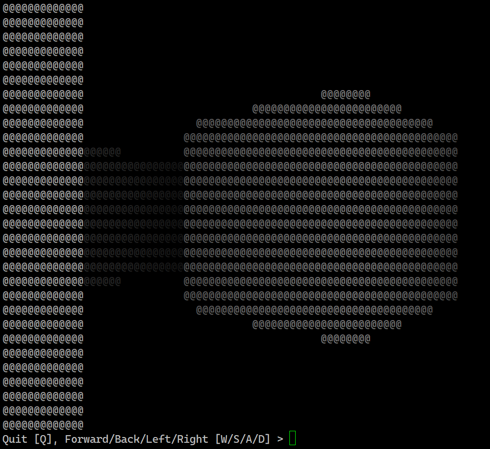

# rayQasting

## Introduction

A demonstration of using [ray casting](https://en.wikipedia.org/wiki/Ray_casting) to render an explorable 3D space only using coloured characters for the visuals, in [KX](https://kx.com/)'s programming language Q.

## Requirements

- `bash` (Tested with Git Bash for Windows' MinTTY terminal)
- `q/kdb+` (Tested in version 4.0)
- The Linux command `tput`

## Controls

- `W`/`S`: Move Forward/Back
- `A`/`D`: Look Left/Right
- `Q`: Quit the Game

## Screenshots

